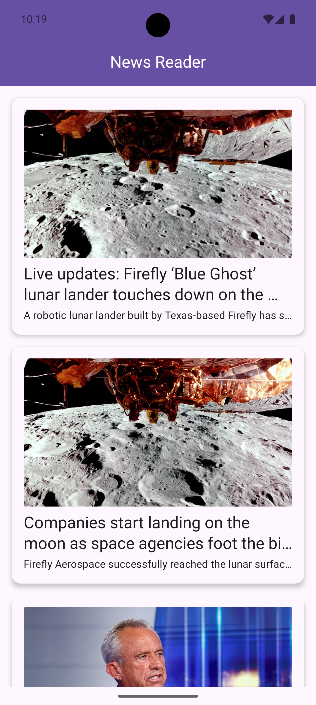

# News App 📰

A modern Android news application that fetches and displays news articles using the **News API**. The app follows a **modular architecture** and is built with **Jetpack Compose** for a smooth UI experience.

## 📸 Screenshots

  
  

## ✨ Features
- 📌 Fetch and display the latest news articles  
- 🔍 View detailed news content  
- 🏗️ Modular architecture for scalability  
- 🚀 Built using **Jetpack Compose**  

## 🛠️ Tech Stack
- **Language**: Kotlin  
- **UI**: Jetpack Compose  
- **Dependency Injection**: Hilt  
- **Asynchronous Processing**: Coroutines & Flow
- **Networking**: Retrofit  
